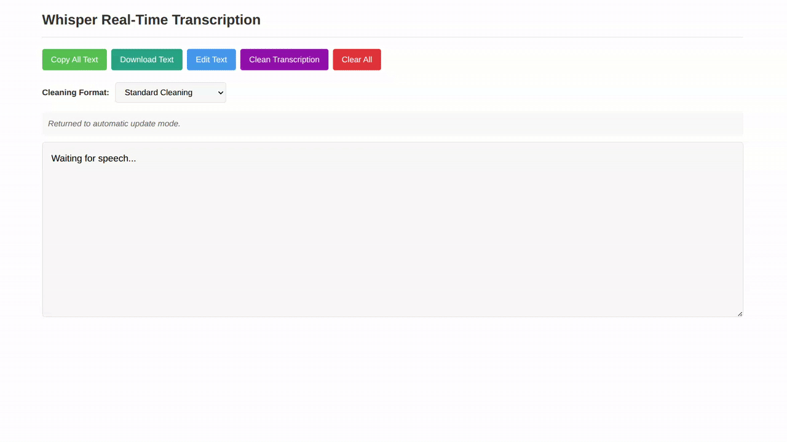

# Whisper Real Time Transcription

This is a demo of real time speech to text with OpenAI's Whisper model. It works by constantly recording audio in a thread and concatenating the raw bytes over multiple recordings.



## Setup

Create and activate a virtual environment (optional but recommended), then install dependencies:

```bash
python3 -m venv whisper_venv
source whisper_venv/bin/activate
pip install -r requirements.txt
```

Whisper also requires the command-line tool [`ffmpeg`](https://ffmpeg.org/) to be installed on your system, which is available from most package managers:

```bash
# on Ubuntu or Debian
sudo apt update && sudo apt install ffmpeg

# on Arch Linux
sudo pacman -S ffmpeg

# on MacOS using Homebrew (https://brew.sh/)
brew install ffmpeg

# on Windows using Chocolatey (https://chocolatey.org/)
choco install ffmpeg

# on Windows using Scoop (https://scoop.sh/)
scoop install ffmpeg
```

For more information on Whisper please see [https://github.com/openai/whisper](https://github.com/openai/whisper)

## Running the Application

The web UI serves at <http://127.0.0.1:5000> (also <http://localhost:5000>) by default. There are two ways to run this application:

### Web UI Mode

To run the application with a web-based user interface:

```bash
python3 web_output.py
```

Common web UI commands with explicit models and microphone backends:

```bash
python3 web_output.py --model tiny --default_microphone pipewire
python3 web_output.py --model base --default_microphone pipewire
python3 web_output.py --model small --default_microphone pipewire
python3 web_output.py --model medium --default_microphone pipewire
python3 web_output.py --model large --default_microphone pipewire
python3 web_output.py --model large-v3-turbo --default_microphone pipewire
```

Gemini API key variants:

```bash
python3 web_output.py --model large-v3-turbo --default_microphone pipewire --gemini_api_key YOUR_GEMINI_API_KEY
python3 web_output.py --model large-v3-turbo --default_microphone pipewire --gemini_api_key "$(cat .env | grep GEMINI_API_KEY | cut -d= -f2)"
python3 web_output.py --model large-v3-turbo --default_microphone pulse --gemini_api_key "$(cat .env | grep GEMINI_API_KEY | cut -d= -f2)"
```

OpenRouter example:

```bash
python web_output.py --model large-v3-turbo --default_microphone pipewire --openrouter_api_key "$(cat .env | grep OPENROUTER_API_KEY | cut -d= -f2)"
```

GPU run (while waiting for the NVIDIA blank screen fix):

```bash
prime-run python3 web_output.py \
  --model large-v3-turbo \
  --default_microphone pipewire \
  --gemini_api_key "$(grep GEMINI_API_KEY .env | cut -d= -f2)"
```

### Terminal Mode

To run the application with output directly in your terminal:

```bash
python3 transcribe_demo.py
```

Model-specific runs (pipewire microphone):

```bash
python3 transcribe_demo.py --model tiny --default_microphone pipewire
python3 transcribe_demo.py --model base --default_microphone pipewire
python3 transcribe_demo.py --model small --default_microphone pipewire
python3 transcribe_demo.py --model medium --default_microphone pipewire
python3 transcribe_demo.py --model large --default_microphone pipewire
```

### Monitoring and maintenance

Run transcription in one terminal, then monitor in another:

```bash
python transcribe_demo.py --model tiny
python monitor_resources.py --name python3
```

Free the web port if needed:

```bash
echo "sudo kill -9 $(lsof -ti:5000)"
```
